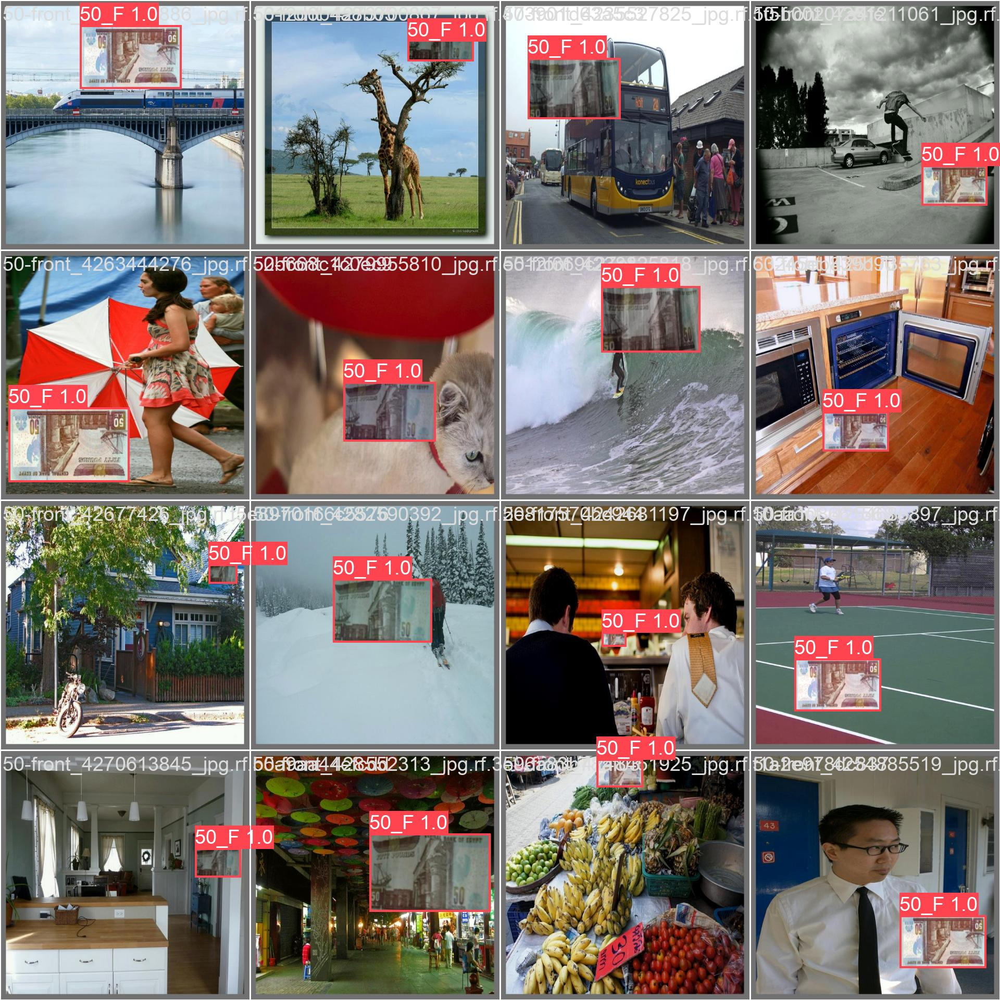
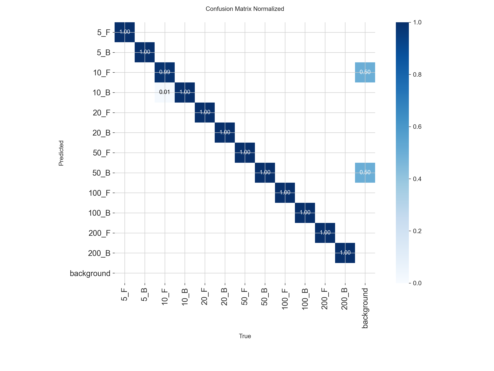
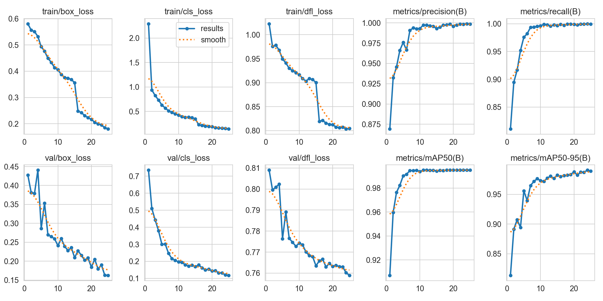

# 💷 Egyptian Currency Recognition System (AI-Powered)

## 📌 Project Overview
The **Egyptian Currency Recognition System** is a computer vision project designed to empower visually impaired individuals in Egypt. It utilizes the **YOLOv8** architecture to detect and identify Egyptian banknotes (Front and Back) in real-time, providing immediate audio feedback regarding the currency value and total amount.

**Developed by:** Ahmed Mohammed Saad El-Raggal  
**ID:** 2221300  
**Institution:** Borg El Arab Technological University  

---

## 🚀 Key Technical Phases

### 1. Data Engineering & Re-indexing
* **Standardization:** All raw images were resized to **640x640** pixels to ensure consistent feature extraction.
* **Logical Re-mapping:** A custom Python script was developed to re-index the dataset classes from random Roboflow labels into a logical sequence (0-11), ensuring that each currency has a sequential "Front" and "Back" ID. This is crucial for the summation logic and audio output.

### 2. Model Training (YOLOv8)
* **Nano-Architecture:** Used `yolov8n.pt` as the backbone to ensure the model is lightweight enough for mobile deployment.
* **Training Specs:** Trained for **25-50 Epochs** on a Tesla T4 GPU, reaching near-perfect convergence.

### 3. Validation & Performance
The model achieved state-of-the-art results on the testing dataset:
| Metric | Score |
| :--- | :---: |
| **Precision** | 99.8% |
| **Recall** | 100% |
| **mAP50** | 99.4% |

### 4. Audio Feedback Engine
* **Dynamic TTS:** Integrated a PowerShell-based `System.Speech` engine for real-time, offline audio announcements.
* **Smart Summation:** The system doesn't just identify; it calculates the total sum of all banknotes visible in the frame and announces it to the user.

---

## 📁 Repository Structure

* `Data_Analytics.ipynb`: Notebook for dataset cleaning, visualization, and re-indexing.
* `Module_Maker.ipynb`: Core notebook for model training, validation, and exporting.
* `Final_Project.ipynb`: Implementation of the real-time detection and voice engine.
* `best.pt`: The final trained weights of the model.
* `Egyptian_Currency_Results/`: Directory containing performance plots, confusion matrices, and training logs.

---

## ⚙️ How to Run
1. Clone the repository: `git clone https://github.com/Ahmed-ElRaggal/Egyptian-Currency-System.git`
2. Install dependencies: `pip install ultralytics opencv-python matplotlib`
3. Run the `Final_Project.ipynb` to start the live detection with audio feedback.

---

## 📱 Future Roadmap
* **Mobile Integration:** Porting the exported `.tflite` model into a Flutter or Unity application.
* **Polymer Notes Update:** Expanding the dataset to include the new Egyptian 10 and 20 EGP polymer banknotes.

---

## 👁️ Visual Results & Performance

Here is a glimpse of the model's performance in recognizing different Egyptian banknotes:

### 1. Real-time Detection Examples

*Bounding boxes accurately identifying the currency class and confidence score.*

### 2. Normalized Confusion Matrix

*The diagonal dark blue line proves the model's near-perfect accuracy with zero false positives across all 12 classes.*

### 3. Training Curves

*Graphs showing the steady decrease in loss and the rapid convergence of Precision and Recall over the training epochs.*

---
